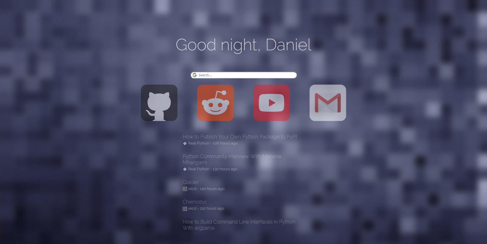

# Startpage

It's a startpage... with feeds!

## Usage

Highly recommend using python's http server if you already have that installed: `python -m http.server`, then load `localhost:8000` on your browser. If you're not a python user, there's many other choices out there, just google it.

## Credits

Many thanks to [Tikaro](https://github.com/0-Tikaro) for allowing me to ~~steal~~ *be inspired by* his startpage!

For a balanced unix diet:
* [r/startpages](https://www.reddit.com/r/startpages/)
* [r/unixporn](https://www.reddit.com/r/unixporn/)
* [r/MinimalWallpaper](https://www.reddit.com/r/MinimalWallpaper/)
